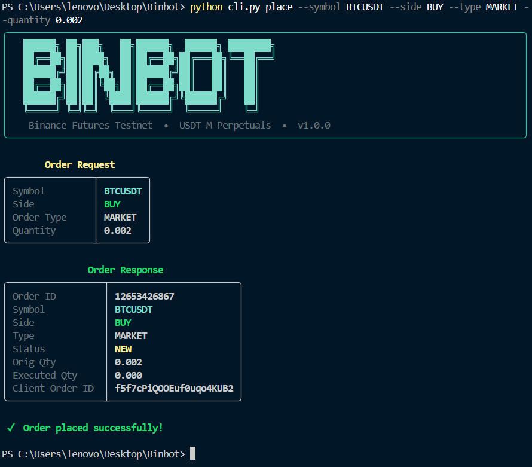
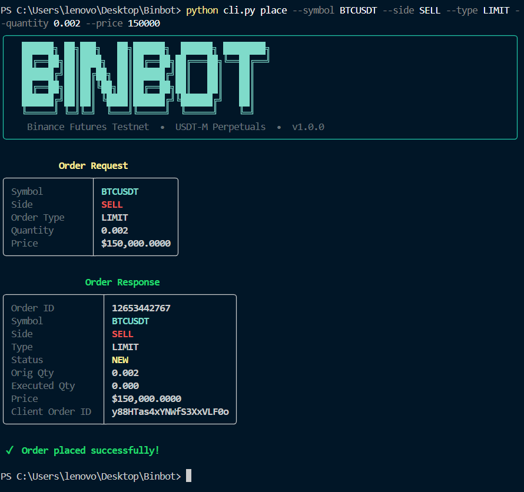
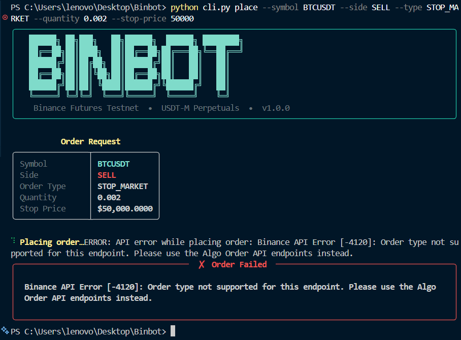
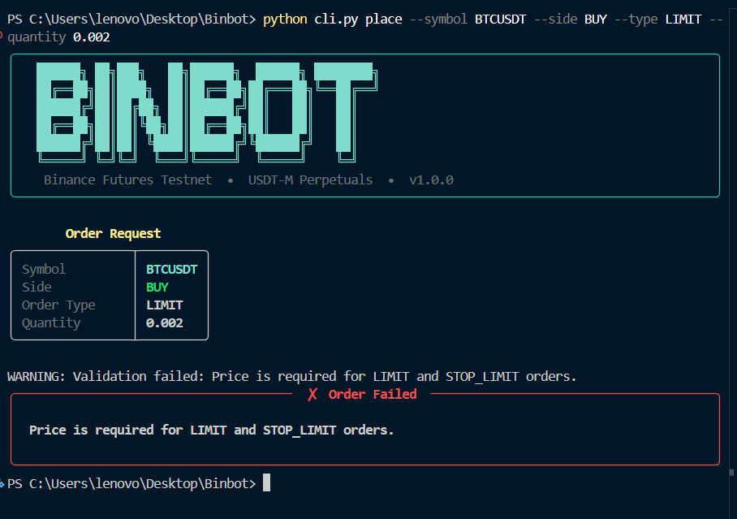
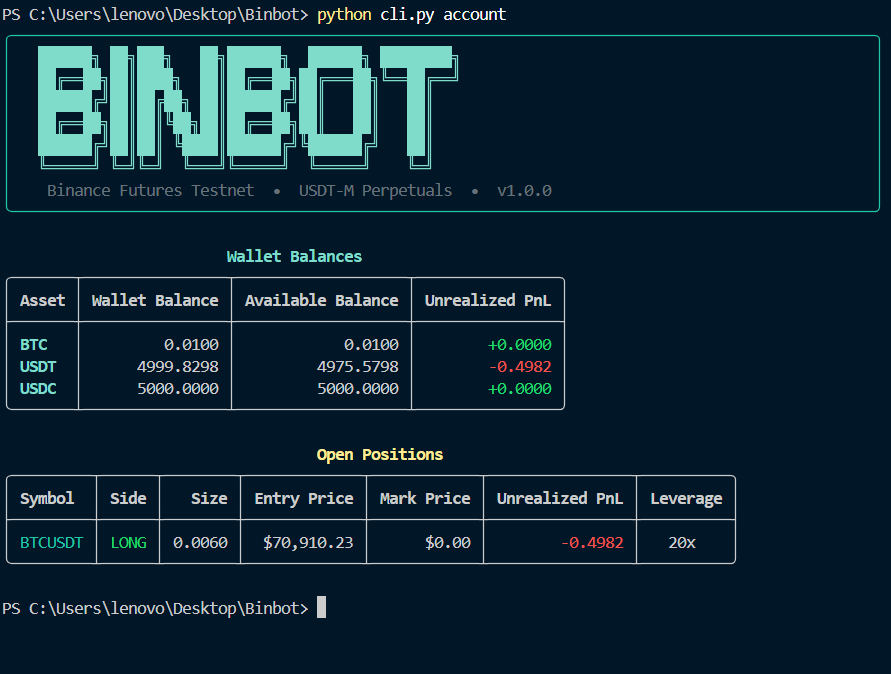
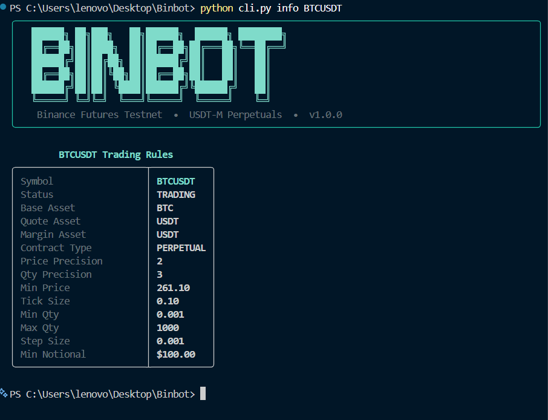
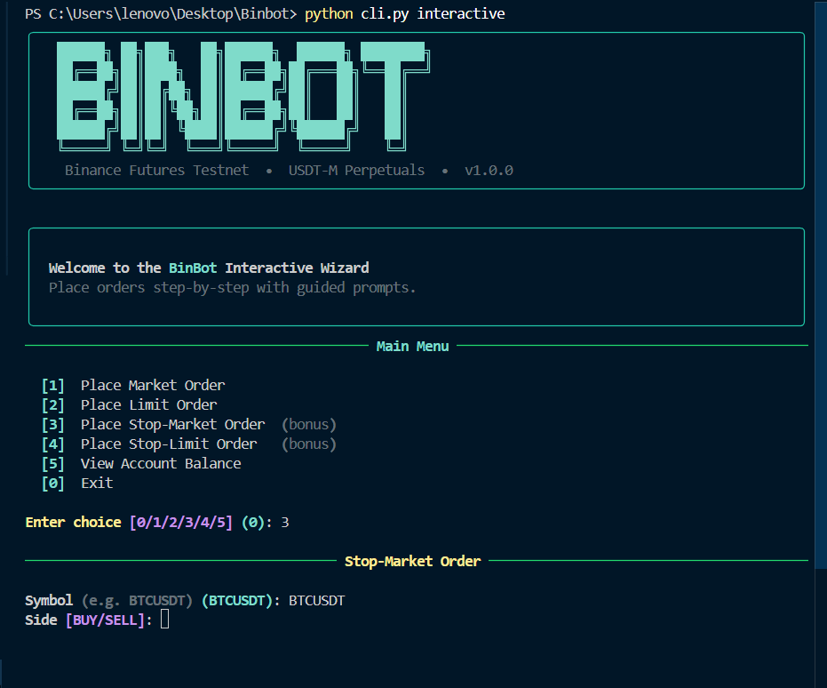
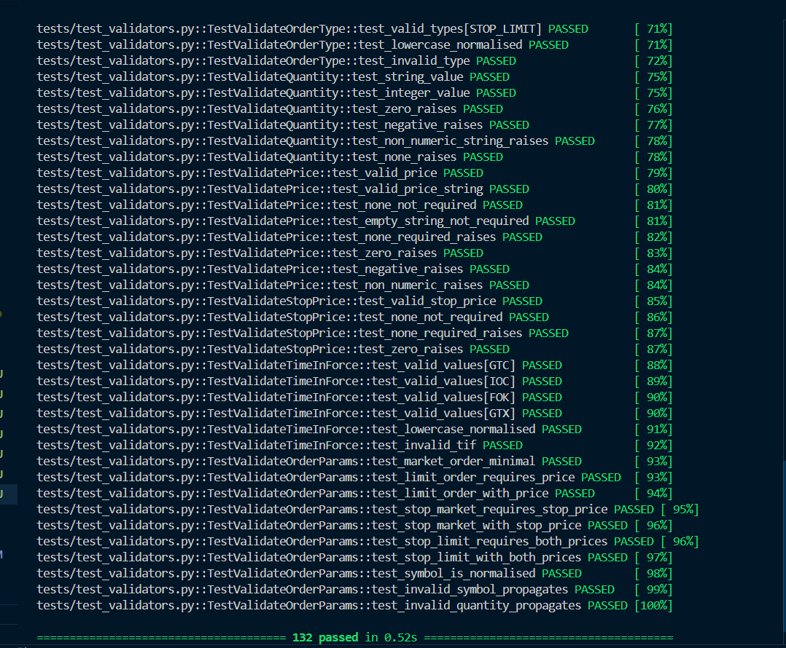
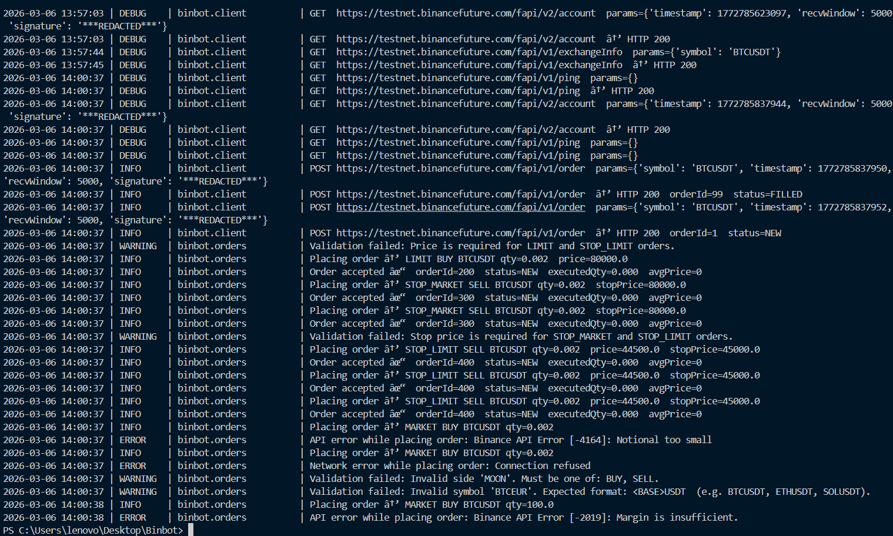

# BinBot 🤖 — Binance Futures Testnet Trading Bot

<div align="center">


**A production-quality Python trading bot for Binance Futures Testnet (USDT-M Perpetuals).**  
Clean architecture · Strict validation · Structured logging · Rich CLI · 132-test suite

</div>

---

## Screenshots

### Banner & Market Order — FILLED


### Limit Order — resting in the order book


### Stop-Market Order (bonus order type)


### Validation Error — caught before touching the network


### Account Balances & Open Positions


### Symbol Trading Rules


### Interactive Wizard Mode (bonus UX)


### Test Suite — 132 passed


### Log File — structured, timestamped entries


---

## Features at a Glance

| | Feature | Detail |
|---|---|---|
| 📈 | **Order types** | MARKET · LIMIT · STOP_MARKET · STOP_LIMIT |
| ↕️ | **Sides** | BUY and SELL |
| 🖥️ | **CLI** | Typer + Rich — coloured tables, spinners, interactive wizard |
| 📋 | **Logging** | Structured file log — every request, response, and error |
| 🛡️ | **Validation** | All inputs validated _before_ the network is touched |
| ⚠️ | **Error handling** | API errors, network failures, and bad input — all handled |
| 🔑 | **Security** | Credentials in `.env` — never hard-coded or logged |
| 🧪 | **Tests** | 132 tests across 5 files — zero real network calls |

---

## Architecture

```
Binbot/
├── bot/
│   ├── __init__.py           # package metadata & version
│   ├── client.py             # Binance REST client — HMAC signing, GET/POST, error normalisation
│   ├── config.py             # credential loader from .env
│   ├── logging_config.py     # dual-handler logging (file DEBUG + console WARNING)
│   ├── orders.py             # OrderManager (business logic) + OrderResult (dataclass)
│   └── validators.py         # per-field validators + composite validate_order_params
├── tests/
│   ├── test_validators.py    # 47 tests — every validator function
│   ├── test_orders_result.py # 18 tests — OrderResult dataclass
│   ├── test_client.py        # 14 tests — HMAC, response parsing, HTTP verbs
│   ├── test_order_manager.py # 20 tests — payload assembly, error handling
│   └── test_cli.py           # 13 tests — help, missing args, exit codes
├── logs/
│   └── binbot.log            # auto-created on first run
├── docs/screenshots/         # README images
├── cli.py                    # CLI entry point (Typer)
├── pytest.ini
├── requirements.txt
├── .env.example
└── README.md
```

### Layer diagram

```
┌──────────────────────────────────────────┐
│                cli.py                    │  ← User interaction (Typer + Rich)
│   place / account / info / interactive   │
└────────────────────┬─────────────────────┘
                     │  calls
┌────────────────────▼─────────────────────┐
│           bot/orders.py                  │  ← Business logic
│   OrderManager.place_order()             │
│   • validates inputs (validators.py)     │
│   • builds API payload                   │
│   • returns OrderResult (never raises)   │
└────────────────────┬─────────────────────┘
                     │  calls
┌────────────────────▼─────────────────────┐
│           bot/client.py                  │  ← API transport layer
│   BinanceClient.post() / .get()          │
│   • HMAC-SHA256 signing                  │
│   • request/response logging             │
│   • translates HTTP/network errors       │
└──────────────────────────────────────────┘
```

---

## Setup

### Prerequisites

- Python **3.10+**
- A free [Binance Futures Testnet](https://testnet.binancefuture.com) account

### 1 — Get Testnet API Keys

1. Go to [testnet.binancefuture.com](https://testnet.binancefuture.com)
2. Log in → **API Management** → **Create API**
3. Copy your **API Key** and **Secret Key**

### 2 — Clone & Install

```bash
git clone https://github.com/<your-username>/binbot.git
cd binbot
pip install -r requirements.txt
```

### 3 — Configure Credentials

```bash
# Windows
copy .env.example .env

# macOS / Linux
cp .env.example .env
```

Edit `.env`:

```dotenv
BINANCE_API_KEY=your_api_key_here
BINANCE_API_SECRET=your_api_secret_here
BINANCE_BASE_URL=https://testnet.binancefuture.com
```

> **Security note:** `.env` is in `.gitignore` and is never committed. API keys are never logged or printed anywhere in the codebase.

---

## Usage

```bash
python cli.py --help
```

```
Commands:
  place        Place a MARKET, LIMIT, STOP_MARKET, or STOP_LIMIT order
  account      Display wallet balances and open futures positions
  info         Show trading rules and precision for a symbol
  interactive  Launch the interactive order-placement wizard
```

---

### Place a Market Order

```bash
python cli.py place --symbol BTCUSDT --side BUY --type MARKET --quantity 0.002
```

| What to expect | |
|---|---|
| Status | `FILLED` immediately |
| `executedQty` | matches your quantity |
| `avgPrice` | the actual fill price |

---

### Place a Limit Order

```bash
python cli.py place --symbol BTCUSDT --side SELL --type LIMIT --quantity 0.002 --price 150000
```

| What to expect | |
|---|---|
| Status | `NEW` (resting in the book — price intentionally above market) |
| `executedQty` | `0.000` until filled |

---

### Place a Stop-Market Order *(bonus)*

```bash
python cli.py place --symbol BTCUSDT --side SELL --type STOP_MARKET \
    --quantity 0.002 --stop-price 50000
```

Triggers a market sell if BTC drops to $50,000.

---

### Place a Stop-Limit Order *(bonus)*

```bash
python cli.py place --symbol BTCUSDT --side SELL --type STOP_LIMIT \
    --quantity 0.002 --price 44500 --stop-price 45000
```

Triggers a limit sell at $44,500 when BTC hits $45,000.

---

### Check Account Balances & Positions

```bash
python cli.py account
```

Displays two Rich tables:
- **Wallet Balances** — asset, wallet balance, available balance, unrealised PnL
- **Open Positions** — symbol, side, size, entry price, mark price, unrealised PnL, leverage

---

### View Symbol Trading Rules

```bash
python cli.py info BTCUSDT
```

Shows price precision, quantity step size, min notional, tick size — everything needed to size orders correctly.

---

### Interactive Wizard *(bonus)*

```bash
python cli.py interactive
```

A full menu-driven experience:
- Choose order type from a numbered menu
- Prompted for each field with inline validation
- Confirmation step before any order is submitted
- Loops back to the menu after each order

---

## CLI Reference

### `place` options

| Option | Short | Required | Description |
|--------|-------|----------|-------------|
| `--symbol` | `-s` | ✅ | Trading pair — must end in `USDT` (e.g. `BTCUSDT`) |
| `--side` | | ✅ | `BUY` or `SELL` |
| `--type` | `-t` | ✅ | `MARKET` \| `LIMIT` \| `STOP_MARKET` \| `STOP_LIMIT` |
| `--quantity` | `-q` | ✅ | Quantity in base asset units (must be > 0) |
| `--price` | `-p` | LIMIT, STOP_LIMIT | Limit price |
| `--stop-price` | | STOP_MARKET, STOP_LIMIT | Stop trigger price |
| `--tif` | | | Time-in-force: `GTC` (default) \| `IOC` \| `FOK` |

---

## Logging

Every run appends structured entries to `logs/binbot.log`.

| Level | What is logged |
|---|---|
| `DEBUG` | Raw HTTP requests (signature redacted) and response status codes |
| `INFO` | Order intent, successful API responses with orderId / status / avgPrice |
| `WARNING` | Validation failures — bad input caught **before** any network call |
| `ERROR` | API errors (e.g. insufficient margin) and network failures |

The API signature is always replaced with `***REDACTED***`. Keys never appear in logs.

Example entries:

```
2026-03-06 12:00:01 | INFO     | binbot.orders | Placing order → MARKET BUY BTCUSDT qty=0.002
2026-03-06 12:00:01 | INFO     | binbot.client | POST https://testnet.binancefuture.com/fapi/v1/order  params={..., 'signature': '***REDACTED***'}
2026-03-06 12:00:02 | INFO     | binbot.client | POST .../fapi/v1/order → HTTP 200  orderId=4688981279  status=FILLED
2026-03-06 12:00:02 | INFO     | binbot.orders | Order accepted ✓  orderId=4688981279  status=FILLED  executedQty=0.002  avgPrice=84320.5
2026-03-06 12:05:10 | WARNING  | binbot.orders | Validation failed: Price is required for LIMIT and STOP_LIMIT orders.
2026-03-06 12:10:00 | ERROR    | binbot.orders | API error while placing order: Binance API Error [-4164]: Order's notional must be no smaller than 100
```

---

## Testing

```bash
# Full suite with HTML coverage report
python -m pytest

# Fast run, verbose output
python -m pytest --no-cov -v
```

**132 tests — zero real network calls.** All HTTP is mocked with `unittest.mock`.

```
============ test session starts ============
collected 132 items

tests/test_cli.py             13 passed
tests/test_client.py          14 passed
tests/test_order_manager.py   20 passed
tests/test_orders_result.py   18 passed
tests/test_validators.py      47 passed

============= 132 passed in 0.6s ============
```

### Coverage breakdown

| Test file | Tests | What is tested |
|---|---|---|
| `test_validators.py` | 47 | Symbol format, side, order type, quantity, price, stop price, time-in-force, composite validator — happy paths **and** every error branch |
| `test_orders_result.py` | 18 | `from_response` / `from_error` factories, `avg_price_float` / `price_float` computed properties, missing-key resilience |
| `test_client.py` | 14 | HMAC-SHA256 signing, `_inject_auth` immutability, response parsing (success / Binance error envelope / HTTP error / non-JSON), GET + POST routing, Timeout → `BinanceNetworkError` |
| `test_order_manager.py` | 20 | Correct payload for all 4 order types, `STOP_LIMIT→STOP` API type mapping, validation errors never reach the network, API / network errors returned as failed `OrderResult` |
| `test_cli.py` | 13 | All `--help` screens, missing required args, invalid enum values, missing-credentials guard, success exits 0 and failure exits 1 |

A full HTML coverage report is generated at `htmlcov/index.html` after running `python -m pytest`.

---

## Design Decisions

### 1. Orders never raise — they return
`OrderManager.place_order()` catches every possible failure (validation, API error, network error) and returns a typed `OrderResult` dataclass. The CLI only ever inspects `.success` — it never needs try/except. This makes the order layer trivially testable and safe to use as a library.

### 2. Validation before network
All inputs are fully validated and normalised (symbol uppercasing, numeric coercion, required-field checks) before a single byte is sent to Binance. Validation failures are logged as `WARNING` and consume zero API rate-limit quota.

### 3. Credentials never touch logs
The HMAC signature is replaced with `***REDACTED***` in every log line. API keys live only in `BinanceClient._session.headers` (in memory) and the `.env` file — which is gitignored.

### 4. STOP_LIMIT → STOP mapping
Binance Futures uses the internal type `STOP` for what is universally called a stop-limit order. BinBot accepts the intuitive name `STOP_LIMIT` in the CLI and maps it silently — the caller never sees the Binance naming quirk.

### 5. Dual logging handlers
- **File handler (`DEBUG+`)** — full detail for post-mortems and auditing
- **Console handler (`WARNING+`)** — only noise-free error alerts; Rich handles all the pretty output

---

## Assumptions

1. **Testnet only by default** — change `BINANCE_BASE_URL` in `.env` to mainnet. Exercise extreme caution with real funds.
2. **One-way position mode** — hedge mode (`positionSide=LONG/SHORT`) is not supported.
3. **Quantity precision** — quantities are sent as-is. Use `python cli.py info <SYMBOL>` to check the step size before placing orders.
4. **Min notional** — Binance requires order value ≥ $100. For BTCUSDT at ~$84k, use quantity ≥ `0.002`.

---

## Dependencies

| Package | Version | Purpose |
|---------|---------|---------|
| `requests` | ≥ 2.31 | HTTP client for Binance REST API |
| `typer` | ≥ 0.9 | CLI framework with auto-help and enum validation |
| `rich` | ≥ 13.7 | Terminal tables, panels, spinners, coloured output |
| `python-dotenv` | ≥ 1.0 | `.env` file loading |
| `pytest` | ≥ 8.0 | Test runner |
| `pytest-cov` | ≥ 5.0 | Coverage reporting |

---

<div align="center">

Built with ❤️ for the Binance Futures Testnet · Python 3.10+ · MIT License

</div>

